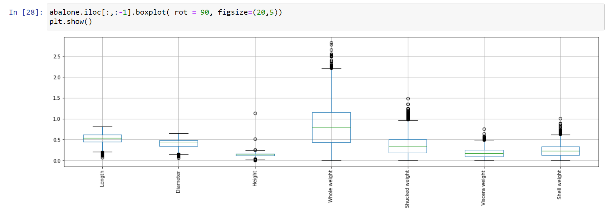

# Abalone Dataset
## Introduction
The objective of this project was to deviate from what we would usually do and work with a dataset we found unique or interesting. We wanted to find correlations within this new and interesting dataset to expand our knowledge without familiar expectations. We also aimed to improve and put to use our knowledge of data science in finding visualizations and analysis of the data. Our hopes are that our results are able to pull meaningful and insightful information from the dataset.

## Selection of data
Our work was done in a Jupyter Notebook. It includes some cleaning and visualizations. It can be found [here](*).   
The original dataset can be found on [UCI's website](https://archive.ics.uci.edu/ml/datasets/abalone) and some analysis can be found on [kaggle](https://www.kaggle.com/datasets/rodolfomendes/abalone-dataset?resource=download)   
This Abalone dataset has 4177 instances with 8 attributes. Every instance has all 8 attributes of Sex, Length, diameter, Height Whole weight, Shucked weight, Viscera weight, and Shell weight, as well as a specific number of Rings, which is directly proportional to the age. The objective is to see if age is directly correlated to the size and weight of abalone. If so, how strong is the correlation, and what else can we say about it? Or secondary objective is to see the significance of the correlation of male or female sex to other attributes of the abalone.

Data preview

During our cleaning, as our primary objective pertains to the age of the abalone, we replaced the attribute “rings” with an age attribute. To do this, we added 1.5 to the number of rings on the abalone to find the age, as stated on the original dataset.

## Methods
•	Seaborn, Matplotlib, Pandas  
•	GitHub  
•	VS Code and Jupyter Notebook

## Results
Our analysis of the data found our primary and secondary hypotheses to be true to an extent. Through the visualization of our data were able to see that as the abalone are young (before their sex can be determined), their age is more strongly correlated to their other 7 attributes, meaning the predictions of age or other attributes made from age can be more accurate, but as they grow older and their sex is determinable, these the correlations become weaker, making these types of predictions harder. This can be seen in our heat maps of male, female, and infant abalone.

For male abalone the correlations between age and other attributes are low

For females, the attributes are low as well, but they are noticeably lower than that of male abalone.

In infants, the correlations of age are significantly higher than that of males or females.

For our second hypothesis, we thought that in abalone, it would be harder to find correlations between sex and other attributes of size and weight. We found that visualized, the difference between the attributes of the male and female abalone appears the be almost none.

## Discussion
Concrete conclusions cannot be made about this dataset based on our analysis and visualizations without the full context of the abalone the data is on. Information such as the location, species, and climate must be given for more conclusive results. 
Something more about this

## Summary
Using visualizations of different attributes of abalone, we were able to find correlations between age and attributes of size, finding that the correlations tend to grow weaker with age. We also found that the significance of sex in size attributes of abalone are minimal, and the greatest predictor of other attributes can be found in the age, especially younger ages.

## References

## Corentin Individual Report

As I was curious about how the existence of outliers in the data, I decided to use a boxplot to see if any of the attributes had larger amounts of outliers and by how much compared to others. My results were the following: 
