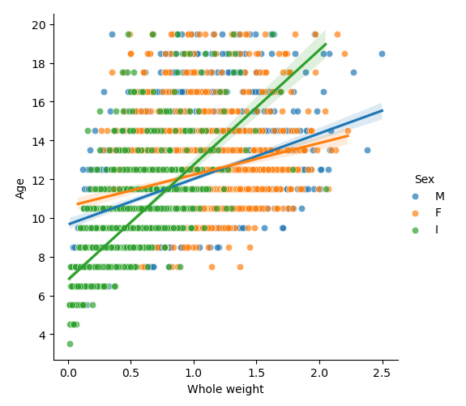

# Abalone Dataset
## Introduction
The objective of this project was to deviate from what we would usually do and work with a dataset we found unique or interesting. We wanted to find correlations within this new and interesting dataset to expand our knowledge without familiar expectations. We also aimed to improve and put to use our knowledge of data science in finding visualizations and analysis of the data. Our hopes are that our results are able to pull meaningful and insightful information from the dataset.

## Selection of data
Our work was done in a Jupyter Notebook. It includes some cleaning and visualizations. It can be found [here](Abalone.ipynb).   
The original dataset can be found on [UCI's website](https://archive.ics.uci.edu/ml/datasets/abalone) and some analysis can be found on [kaggle](https://www.kaggle.com/datasets/rodolfomendes/abalone-dataset?resource=download)   
This Abalone dataset has 4177 instances with 8 attributes. Every instance has all 8 attributes of Sex, Length, diameter, Height Whole weight, Shucked weight, Viscera weight, and Shell weight, as well as a specific number of Rings, which is directly proportional to the age. The objective is to see if age is directly correlated to the size and weight of abalone. If so, how strong is the correlation, and what else can we say about it? Or secondary objective is to see the significance of the correlation of male or female sex to other attributes of the abalone.

Data preview

During our cleaning, as our primary objective pertains to the age of the abalone, we replaced the attribute “rings” with an age attribute. To do this, we added 1.5 to the number of rings on the abalone to find the age, as stated on the original dataset.

## Methods
•	Seaborn, Matplotlib, Pandas  
•	GitHub  
•	VS Code and Jupyter Notebook

## Results
Our analysis of the data found our primary and secondary hypotheses to be true to an extent. Through the visualization of our data were able to see that as the abalone are young (before their sex can be determined), their age is more strongly correlated to their other 7 attributes, meaning the predictions of age or other attributes made from age can be more accurate, but as they grow older and their sex is determinable, these the correlations become weaker, making these types of predictions harder. This can be seen in our heat maps of male, female, and infant abalone.

For male abalone the correlations between age and other attributes are low

For females, the attributes are low as well, but they are noticeably lower than that of male abalone.

In infants, the correlations of age are significantly higher than that of males or females.

For our second hypothesis, we thought that in abalone, it would be harder to find correlations between sex and other attributes of size and weight. We found that visualized, the difference between the attributes of the male and female abalone appears the be almost none, while infants are generally smaller in all attributes compared to both males and females.

## Discussion
Concrete conclusions cannot be made about this dataset based on our analysis and visualizations without the full context of the abalone the data is on. Information such as the location, species, and climate must be given for more conclusive results. We also need to be aware that sex has a huge impact on the correlation between the abalone's physical attributes and its age, so we would likely have to find other attributes to look at to get better predictions for older abalone whose gender is identifiable.

We also found that we had some minor issues with the fact that the sex was a string and not a float, so some calculations or plots did not take sex into account, despite us wanting to.

## Summary
Using visualizations of different attributes of abalone, we were able to find correlations between age and attributes of size, finding that the correlations tend to grow weaker with age. We also found that the significance of sex in size attributes of abalone are minimal, and the greatest predictor of other attributes can be found in the age, especially younger ages.

## References

# Corentin Individual Report
## Visualization

As I was curious about how the existence of outliers in the data, I decided to use a boxplot to see if any of the attributes had larger amounts of outliers and by how much compared to others. My results were the following: 

From this boxplot, we can observe that there is a tendency for length and diameter to be lower than normal, while weight has a tendency to be higher than normal. I did not include age because age is, on average, one degree of magnitude larger than the 8 other attributes, so including age would make the boxplot extremely difficult to analyze visually.
## Making a Predictive model
As I was interested in whether or not it was possible to guess the age of an abalone based on the 8 attributes of size and weight it has, I decided to make use of Scikit-Learn's Support Vector Machine model. I would have most likely been more accurate if I had turned my age into a categorical value (binary) and used a Support Vector Classifier (SVC), but it would have been much harder to see just how precise the algorithm it.

Therefore, I opted to use the Support Vector Regression, which is able to work with the continuous age data points we have. After splitting our dataset into a training set (70% of the data) and a testing set (30%), I found that my SVR had a score if 52% for the testing set and 56% for the training set.

This is far from ideal. However, it is a result to be expected, especially since we saw that there was a relatively weak correlation between each of the attributes with age. However, looking at how much the result is, on average, off by, we notice that although it does not get the exactly correct age, its average age guess is close to the real age.

Finally, I decided to see if there was a significant difference between the estimation score of different sexes, as we had previously seen that there was a tighter correlation with infants, then male, then female. Indeed, I found that the scores were the best for infants, were lower for males, and even lower for females.

# Alex Individual Report
## Visualization

To try and predict the age from the other attributes, or attributes based on age, I decided that I would make linear models based off the data we have. This would be linear models on the scatters plots that we had previously used.

## linear model

As the data was hard to view and predict the age, I thought it would be useful to make a linear model. With this, it would be able to take into account all the data we have for any specific relation and create the linear model to fit the data. In viewing the models that were created, it is easy to see that the linear model is not a perfect representation of how how the particular attribute changes in with accordance to age. For each plot, I added the three categories of the population (M, F, I). With this, you can see that as the linear model for infants predicts their attributes as they turn into adults, the model loses some accuracy, but still trends in the correct general direction. The same can be said for the male and female linear models in trying to predict infant attributes. To get more accurate predictions, different models can be explored, but the linear model I have created seems to be within what is possible for the data set. In making these models, I considered removing the outliers, but ended up keeping them. The reasoning for this is that I consider the ouliers to be normal variations for individuals within the dataset, and by extension the natural population of abalone. Without the context, I assumed that these are true outliers and are not the result of large errors in measurement or any other mistakes.
